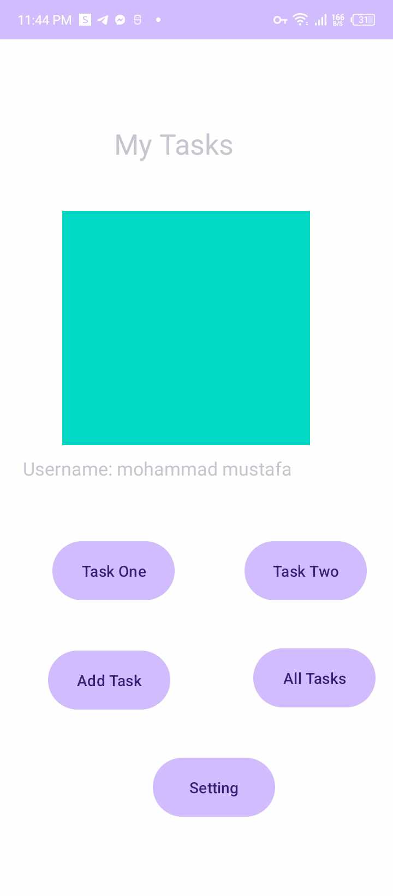
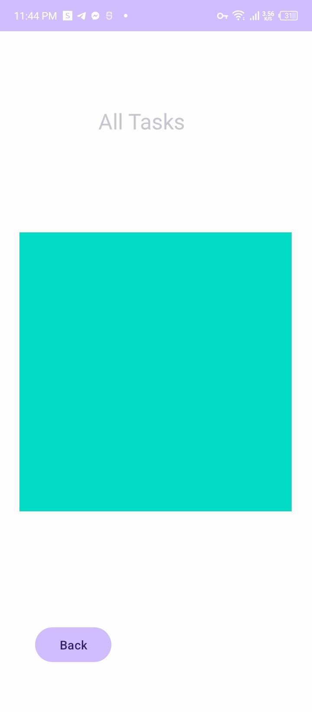
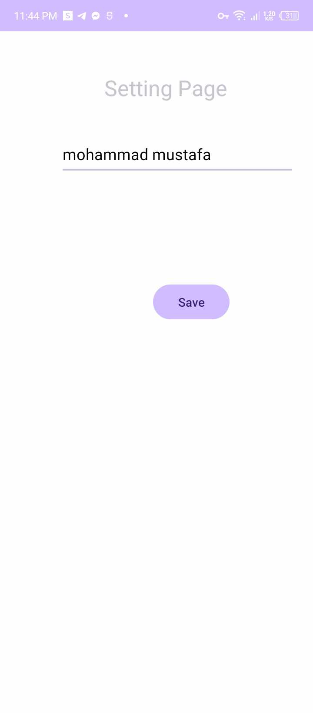
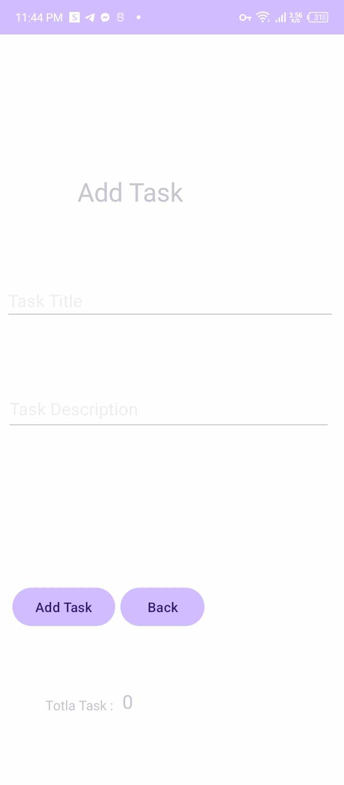
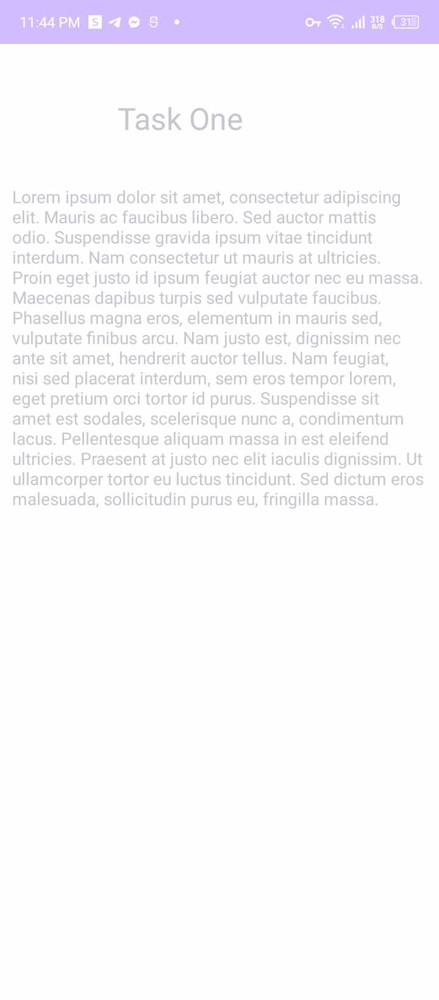
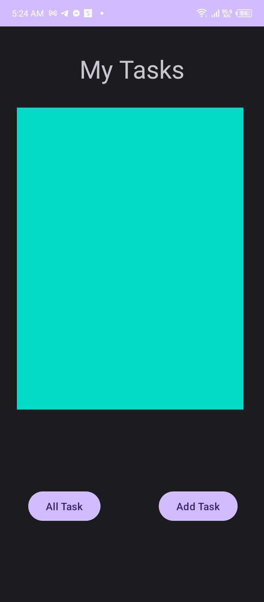
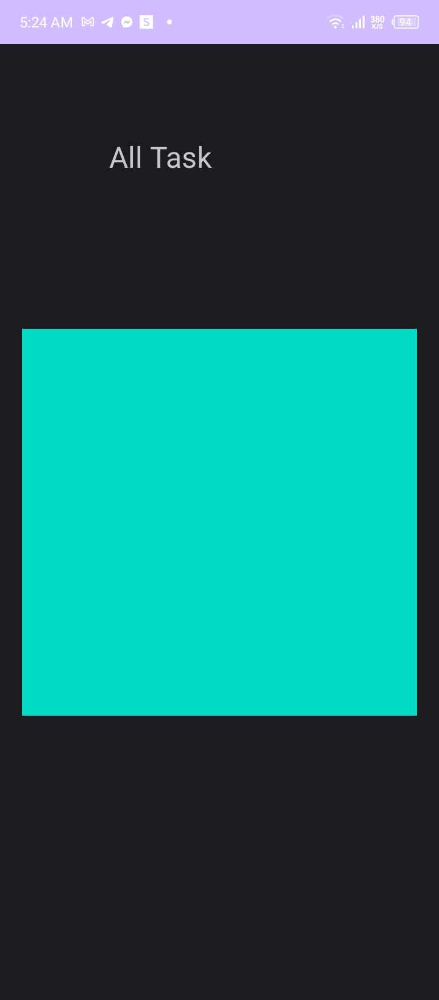
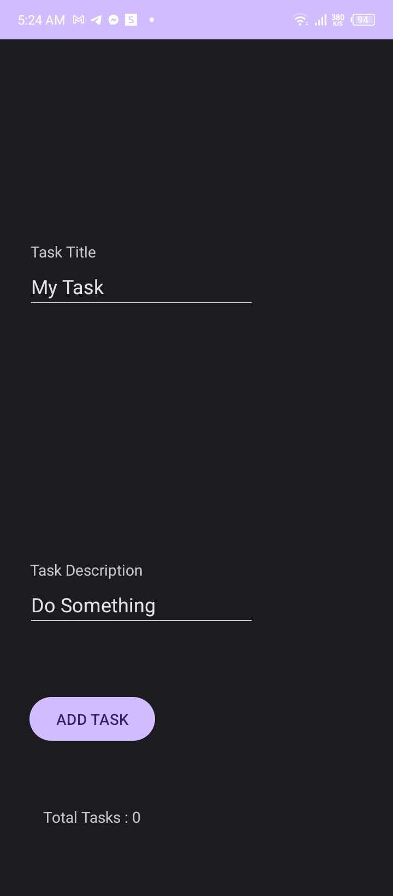

# taskmaster
## Description

The Task Master mobile application features 6 main pages:

# lab 27

## Home

## All

## setting

## add task

## TASK1

## TASK2

The Task Master mobile application features three main pages:

1. **Home Page**:
   - Includes five buttons: "Add new Task" , "All Tasks" ,"Task1","Task1","Setting".
   - Displays an image.
   - task btn redirect you to task details.
2. **Add New Task Page**:
   - Contains an "Add Task" button that, when clicked, shows a "Submitted" label on the page.
   - Allows users to input task description and task title.

3. **All Tasks Page**:
   - Displays an image.
   - back button.

4. **Setting Page**:
   - change user at home page by write new user name and press on save btn.

# lab26

## Home

## All

## Add before submit

## Add after submit

1. **Home Page**:
   - Includes two buttons: "Add new Task" and "All Tasks."
   - Displays an image.

2. **Add New Task Page**:
   - Contains an "Add Task" button that, when clicked, shows a "Submitted" label on the page.
   - Allows users to input task description and task title.

3. **All Tasks Page**:
   - Displays an image.
   - back button.

