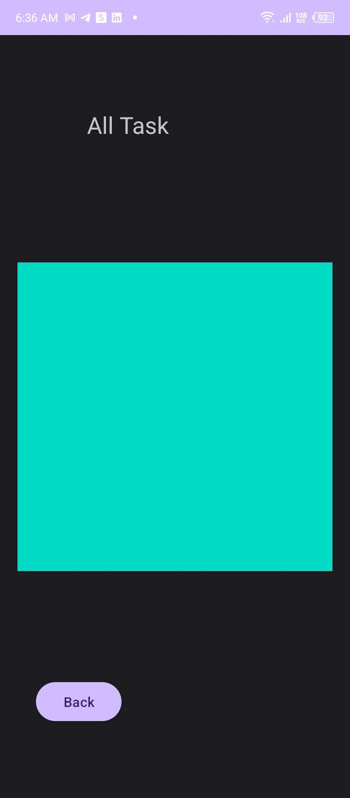

# taskmaster

## Home

## All

## Add before submit

## Add after submit

## Description

The Task Master mobile application features three main pages:

1. **Home Page**:
   - Includes two buttons: "Add new Task" and "All Tasks."
   - Displays an image.

2. **Add New Task Page**:
   - Contains an "Add Task" button that, when clicked, shows a "Submitted" label on the page.
   - Allows users to input task description and task title.

3. **All Tasks Page**:
   - Displays an image.
