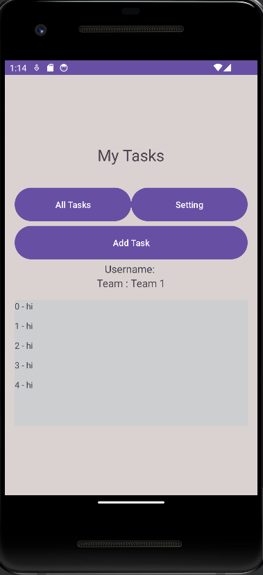

# taskmaster
## Description
# Lab34
### update
When clicking on the task, it redirects me to an editing page where I can modify all the information associated with it.
### main before edit task 

###  edit task paige

###  home after edit on task 

# lab33
## Task Master

### Second Entity Creation

A second entity for teams has been introduced, featuring a name attribute and a task list.

### Task Ownership Restructured

Tasks have been updated to be associated with teams. Three default teams have been established: "Team 1" ,"Team 2", and "Team 3."

### Improved Task Creation Process

A spinner has been implemented to facilitate team selection when creating a task.

### Enhanced User Experience

Users now have the option to choose a team for task assignment. The homepage tasks are filterable based on the selected team.

# lab32
Updated all references to the Task data to instead use AWS Amplify to access data in DynamoDB instead of in Room.

Modified Add Task form to save the data entered in as a Task to DynamoDB.

# lab30
## Ui Test

# lab29
## Home show tasks from database

## task details after click on it at home 
.jpg)
## add task to database

1. **Home Page**:
   - Includes 3 buttons: "Add new Task" , "All Tasks" ,"Setting".
   - Clickable recyclerView to redirect you to task details.

2. **task details**:
   - Show you all task details after click on it 

 3. **Add New Task Page**:
   - Contains an "Add Task" button that, when clicked, shows a "Submitted" snackbar on the page.
   - Allows users to input task description and task title and category.

# lab28
## Home

## task details after click on it at home 

1. **Home Page**:
   - Includes 3 buttons: "Add new Task" , "All Tasks" ,"Setting".
   - Clickable recyclerView to redirect you to task details.

2. **task details**:
   - Show you all task details after click on it 

# lab 27

## Home

## All

## setting

## add task

## TASK1

## TASK2

The Task Master mobile application features three main pages:

1. **Home Page**:
   - Includes five buttons: "Add new Task" , "All Tasks" ,"Task1","Task1","Setting".
   - Displays an image.
   - task btn redirect you to task details.
2. **Add New Task Page**:
   - Contains an "Add Task" button that, when clicked, shows a "Submitted" label on the page.
   - Allows users to input task description and task title.

3. **All Tasks Page**:
   - Displays an image.
   - back button.

4. **Setting Page**:
   - change user at home page by write new user name and press on save btn.

# lab26

## Home

## All

## Add before submit

## Add after submit

1. **Home Page**:
   - Includes two buttons: "Add new Task" and "All Tasks."
   - Displays an image.

2. **Add New Task Page**:
   - Contains an "Add Task" button that, when clicked, shows a "Submitted" label on the page.
   - Allows users to input task description and task title.

3. **All Tasks Page**:
   - Displays an image.
   - back button.

